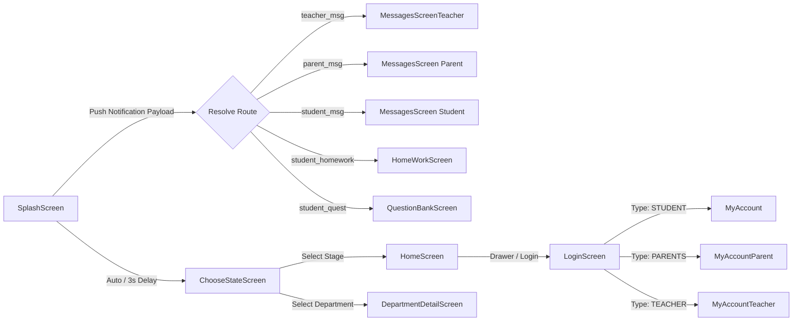
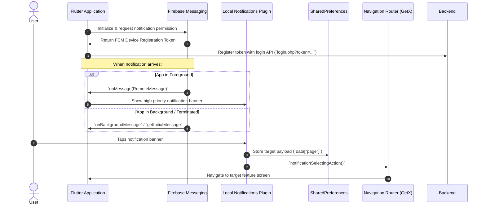

# 📘 Al-Furqan Private Schools (مدارس الفرقان الخاصة)
## Complete Technical Architecture & Developer Documentation

---

## 📑 Table of Contents
1. [System Overview & Architecture](#1-system-overview--architecture)
2. [State Management & Navigation Flow](#2-state-management--navigation-flow)
3. [Complete API & Network Specification](#3-complete-api--network-specification)
4. [Data Models Specification](#4-data-models-specification)
5. [Push Notification & Deep-Linking Lifecycle](#5-push-notification--deep-linking-lifecycle)
6. [Design System, Typography & Global Widgets](#6-design-system-typography--global-widgets)
7. [Security Analysis & Data Protection](#7-security-analysis--data-protection)
8. [Platform Build & Deployment Configuration](#8-platform-build--deployment-configuration)
9. [Developer Guide & Contribution Workflows](#9-developer-guide--contribution-workflows)

---

## 1. System Overview & Architecture

The **Al-Furqan School Application** is built with **Flutter** (Dart 3.x) using a layered Client-Service-Model architecture with reactive controller bindings.

```mermaid
graph TD
    subgraph UI_Layer [Presentation / UI Layer]
        V_Start[Start & School Selection]
        V_Home[Home Screen & Dashboards]
        V_Student[Student Portal Views]
        V_Parent[Parent Portal Views]
        V_Teacher[Teacher Portal Views]
        V_App[Public Info Views]
    end

    subgraph State_Layer [State Management & Controller Layer]
        C_GetX[GetxControllers & GetBuilders]
        C_Provider[ChangeNotifier Provider - AppLanguage]
    end

    subgraph Service_Layer [Service & Network Layer]
        S_Auth[AuthService]
        S_Logged[LoggedUserService]
        S_Parent[ParentService]
        S_Teacher[TeacherService]
        S_AppInfo[AppInfoService]
        S_Start[StarScreenServices]
        S_Join[JoinApplicationService]
        S_Contact[ContactUsService]
        S_Notif[PushNotificationService]
    end

    subgraph Data_Layer [Data & Storage Layer]
        M_Models[Data Models JSON Serializers]
        SP[SharedPreferences Local Storage]
        DioClient[Dio HTTP Client]
    end

    subgraph Remote_Layer [External & Cloud Services]
        BackendAPI[(Al-Furqan School PHP API)]
        FirebaseFCM[Firebase Cloud Messaging]
        FirebaseAnalytics[Firebase Analytics]
        MapsService[Apple Maps / Google Maps]
    end

    UI_Layer --> State_Layer
    State_Layer --> Service_Layer
    Service_Layer --> Data_Layer
    Data_Layer --> Remote_Layer
```



### Architectural Highlights
* **Presentation Layer**: Built using modular `StatelessWidget` and `StatefulWidget` instances bound to `GetxController` states.
* **Business Logic**: Encapsulated in controller classes located alongside views (`views/<module>/controller/<module>_controller.dart`).
* **Service Layer**: Dedicated service classes in `lib/services/` that handle external REST/JSON HTTP communications using `Dio`.
* **Local Persistence**: `SharedPreferences` manages user tokens, session IDs, active role flags, cached route redirects, and language preferences.

---

## 2. State Management & Navigation Flow

### State Management Patterns
1. **GetX (`GetxController` / `GetBuilder`)**:
   * Used across feature screens for lifecycle management (`onInit`, `onClose`), form state handling, and view updates via `update()`.
   * Examples: `HomeScreenController`, `LoginController`, `StartScreen`, `ReportController`, `StudentInfoController`.
2. **Provider (`ChangeNotifierProvider` / `ChangeNotifier`)**:
   * Used exclusively for root-level **dynamic language switching** (`AppLanguage` in [`lib/I10n/AppLanguage.dart`](lib/I10n/AppLanguage.dart)).
3. **Local State (`StatefulWidget` / `setState`)**:
   * Used in standalone widgets and account home screens (`SplashScreen`, `MyAccount`, `MyAccountParent`, `MyAccountTeacher`, `AppDrawer`).

### Navigation & Routing Map



---

## 3. Complete API & Network Specification

**Base URL**: `https://alforqanschools.sch.qa/site/api/`  
**Web Domain**: `https://www.alrayyanprivateschools.com`  
**Network Client**: `Dio` (v5.9.1)

### 3.1 Authentication & Registration API
| Endpoint | Method | Parameters | Description |
| :--- | :--- | :--- | :--- |
| `login.php` | `GET` | `type` (`STUDENT`, `PARENTS`, `TEACHER`), `username`, `password`, `token` (FCM) | Authenticates user and returns user info (ID, name, class). |
| `application.php` | `GET` | `exp_fname`, `exp_email`, `exp_preschool`, `exp_mob`, `exp_date`, `exp_idstudent`, `exp_birthdate`, `exp_type`, `exp_religion`, `exp_birthplace`, `exp_nationalty`, `exp_citybrth`, `exp_provincebrth`, `exp_registnum`, `exp_address`, `exp_city`, `exp_zipcode`, `exp_tels`, `exp_year`, `exp_registstatus`, `exp_pname`, `exp_relation`, `exp_pjob`, `exp_notes` | Submits a new student admission request. |

---

### 3.2 Public & School Information API
| Endpoint | Method | Parameters | Description |
| :--- | :--- | :--- | :--- |
| `slide.php` | `GET` | `school_type` (Optional) | Fetches hero banner slideshow images for home. |
| `slide_app.php` | `GET` | *None* | Fetches main portal slider images. |
| `office_department_app.php` | `GET` | *None* | Lists administrative offices and educational departments. |
| `office_department_app_articles.php` | `GET` | `dep_id` | Returns details, description, and articles of a specific department. |
| `about.php` | `GET` | *None* | Fetches school overview and history. |
| `about_app.php` | `GET` | *None* | Fetches information about the app and creators. |
| `school_desc.php` | `GET` | *None* | Returns the principal/director's address. |
| `news.php` | `GET` | `school_type` | Retrieves latest news articles list. |
| `news_view.php` | `GET` | `school_type`, `news_id` | Retrieves full content and metadata for a specific news article. |
| `subjects.php` | `GET` | *None* | Returns curricula and subject categories. |
| `art.php` | `GET` | `dep_id` | Returns subject specifics and curriculum content. |
| `privacy.php` | `GET` | *None* | Returns school privacy policy text. |
| `agreament.php` | `GET` | *None* | Returns terms and conditions text. |
| `social.php` | `GET` | *None* | Returns school social media links (FB, Instagram, Twitter, Snapchat, WhatsApp, App links). |
| `contact.php` | `POST` | `name`, `email`, `subject`, `message`, `mobile` | Submits feedback, inquiries, or complaints. |

---

### 3.3 Student Portal API
| Endpoint | Method | Parameters | Description |
| :--- | :--- | :--- | :--- |
| `student_download_files.php` | `GET` | `student_id` | Lists electronic downloadable course files. |
| `student_download_files_view.php` | `GET` | `student_id`, `file_id` | Fetches details and download URL of a specific file. |
| `student_homework.php` | `GET` | `student_id` | Lists homework assignments assigned to the student. |
| `student_homework_view.php` | `GET` | `student_id`, `homework_id` | Fetches full assignment description and attached files. |
| `student_quest_bank.php` | `GET` | `student_id` | Lists questions available in the question bank. |
| `student_quest_bank_view.php` | `GET` | `student_id`, `file_id` | Returns specific question details and answers. |
| `student_prog.php` | `GET` | `student_id` | Lists important programs and digital tools for students. |
| `student_books.php` | `GET` | `student_id` | Lists digital textbooks and study references. |
| `student_ask_income.php` | `GET` | `student_id` | Returns questions asked by the student and teacher replies. |
| `student_ask_income_view.php` | `GET` | `student_id`, `msg_id` | Full thread view of an asked question. |
| `sch.php` | `GET` | `class_id` | Retrieves weekly class timetable and schedule. |
| `reportyear.php` | `GET` | `studentid` (External browser launch) | Web report card and academic grades. |

---

### 3.4 Parent Portal API
| Endpoint | Method | Parameters | Description |
| :--- | :--- | :--- | :--- |
| `parent_report_about.php` | `GET` | `parent_id` | Lists student evaluation and progress reports. |
| `parent_report_about_view.php` | `GET` | `parent_id`, `report_id` | Detailed evaluation report breakdown. |
| `parent_absence.php` | `GET` | `parent_id` | Student attendance logs and absence records. |
| `student_info.php` | `GET` | `student_id` | Retrieves student profile, registration number, and stage info. |
| `parent_msg_income.php` | `GET` | `parent_id` | Inbox messages received from teachers or administration. |
| `parent_msg_income_view.php` | `GET` | `parent_id`, `msg_id` | Content of an incoming message. |
| `parent_msg_send.php` | `POST` | `parent_id`, `sendto_type`, `teacher_id`, `title`, `text` | Dispatches a message to a teacher or administration. |
| `parent_msg_sent.php` | `GET` | `parent_id` | Outbox messages sent by the parent. |
| `parent_msg_sent_view.php` | `GET` | `parent_id`, `msg_id` | Content of a sent message. |
| `teachers_list.php` | `POST` | *None* | Returns list of teachers for message recipient selection. |

---

### 3.5 Teacher Portal API
| Endpoint | Method | Parameters | Description |
| :--- | :--- | :--- | :--- |
| `teacher_reports.php` | `GET` | `teacher_id` | Lists student reports created by the teacher. |
| `teacher_report_view.php` | `GET` | `teacher_id`, `report_id` | Details of a submitted report. |
| `teacher_report_add.php` | `GET` | `teacher_id`, `student_id`, `date`, `text` | Submits a new evaluation report for a student. |
| `categories_list.php` | `GET` | `ctg_id` (Optional) | Returns stages, grades, and section levels. |
| `student_list.php` | `GET` | `class_id` | Lists students enrolled in a specific class. |
| `teacher_homework.php` | `GET` | `teacher_id` | Lists homework tasks created by the teacher. |
| `teacher_homework_view.php` | `GET` | `teacher_id`, `homework_id` | Details of homework submission. |
| `teacher_quest_bank.php` | `GET` | `teacher_id` | Question bank repository managed by the teacher. |
| `teacher_msg_sent.php` | `GET` | `teacher_id` | Sent message outbox for the teacher. |
| `teacher_msg_send.php` | `GET` | `teacher_id`, `sendto_type`, `to_id`, `title`, `text` | Sends a message to a student or parent. |
| `teacher_msg_sent_view.php` | `GET` | `teacher_id`, `msg_id` | Details of a sent message. |

---

## 4. Data Models Specification

All models are located under `lib/models/` and include factory deserializers (`fromJson`) and serializers (`toJson`).

### Key Model Reference

```
lib/models/
├── AppInfo/
│   ├── aboutSchool.dart       # General single-record text container (title, content)
│   ├── News.dart              # News list item model
│   ├── newsDetails.dart       # Detailed news article model
│   ├── photo.dart & photoAlbum.dart  # Photo galleries and album items
│   ├── sliderPhotos.dart      # Hero slider banner model
│   ├── subject.dart           # Subject entity
│   ├── subjectDetails.dart    # Subject article details
│   └── videos.dart            # Video album entry
├── new/
│   ├── department_model.dart  # Department list model
│   ├── departmen_detail_model.dart # Department info and sub-items
│   ├── student_list_model.dart# Parent's multi-student directory
│   ├── student_info_model.dart# Student profile information
│   ├── social_link.dart       # Social URLs (FB, Twitter, WhatsApp, App stores)
│   └── slide_show_model.dart  # Slide show image metadata
├── parents/
│   ├── attendance.dart        # Attendance & absence record
│   ├── reports.dart           # Evaluation report summary
│   └── reportDetails.dart     # Detailed evaluation criteria
├── Student/
│   ├── AskedQuestion.dart     # Question submitted to teacher
│   ├── AskedQuestionDetails.dart # Threaded answer from teacher
│   ├── book.dart              # Textbook reference
│   └── scedules_model.dart    # Timetable days and period schedule
└── teacher/
    ├── category.dart          # Academic categories and grade levels
    ├── homeWork.dart          # Teacher-side homework record
    ├── HomeWorkDetails.dart   # Teacher-side homework details
    ├── questionBank.dart      # Teacher-side question bank entry
    ├── student.dart           # Student selection model
    └── teacherReport.dart     # Teacher evaluation report record
```

---

## 5. Push Notification & Deep-Linking Lifecycle

Push notifications are orchestrated through **Firebase Cloud Messaging (FCM)** and **Flutter Local Notifications Plugin** in [`lib/services/notification.dart`](lib/services/notification.dart).



### Notification Payload Routing Table

| Payload `page` Value | Destination Screen | Arguments / Notes |
| :--- | :--- | :--- |
| `teacher_msg` | `MessagesScreenTeacher` | Navigates to Teacher Inbox |
| `parent_msg` | `MessagesScreen` | Navigates to Parent Inbox (`arguments: [0]`) |
| `student_msg` | `MessagesScreen` | Navigates to Student Inbox (`arguments: [1]`) |
| `student_homework` | `HomeWorkScreen` | Opens student homework list |
| `student_quest` / `parent_quest` | `QuestionBankScreen` | Opens Question Bank |
| `student_report` | `HomeWorkScreen` | Opens Student Reports |
| *Default / Other* | `ChooseStateScreen` | Opens School Stage Selector |

---

## 6. Design System, Typography & Global Widgets

### 6.1 Color Palette Tokens ([`lib/globals/commonStyles.dart`](lib/globals/commonStyles.dart))

| Token Name | Hex Code | Visual Sample | Usage |
| :--- | :--- | :---: | :--- |
| `mainColor` | `#8A1538` |  | Primary brand color (Qatar Maroon) for AppBars, buttons, headers |
| `white` | `#F5EEDC` |  | Soft cream background color for cards and scaffolds |
| `teal` | `#97BFB4` |  | Secondary accent color for links, borders, sub-actions |
| `mainTextColor` | `#0C1F38` |  | Primary dark body text |
| `brandColor` | `#7E2670` |  | Secondary brand purple accent |

### 6.2 Typography
* **Primary Font Family**: `DroidKufi` (loaded from `assets/fonts/`).
  * `DroidKufiRegular.ttf`: Normal body text, subtitles, and list titles.
  * `DroidKufiBold.ttf` (`FontWeight.w700`): Section titles, button text, and AppBar headings.

### 6.3 Reusable Widget Library ([`lib/globals/widgets/`](lib/globals/widgets/))
1. **`AppDrawer`** ([`DrawerWidget.dart`](lib/globals/widgets/DrawerWidget.dart)): Full-featured side navigation drawer with session detection, role-aware account redirection, social media links, coordinates map launcher, and language switcher.
2. **`HomeCard`** ([`HomeCard.dart`](lib/globals/widgets/HomeCard.dart)): Stylized rounded action tile for home dashboard shortcuts.
3. **`ContainerCardWidget`** ([`news_card.dart`](lib/globals/widgets/news_card.dart)): News card with thumbnail and title preview.
4. **`ExpandableText`** ([`expandable_text.dart`](lib/globals/widgets/expandable_text.dart)): Multi-line collapsible text block with animated "Show More / Show Less" toggle.
5. **`OfflineWidget`** ([`offline_widget.dart`](lib/globals/widgets/offline_widget.dart)): Bottom persistent network alert banner with retry trigger.
6. **`MainButton`** ([`mainButton.dart`](lib/globals/widgets/mainButton.dart)): Standardized full-width rounded primary button.
7. **`AppTextField`** ([`textFiled.dart`](lib/globals/widgets/textFiled.dart)): Styled form text input with validation indicators.

---

## 7. Security Analysis & Data Protection

### 🔒 Current Security Posture & Recommendations

1. **Authentication Credentials in Local Storage**:
   * *Status*: In [`authService.dart`](lib/services/authService.dart), parent credentials (`usernameParent` and `passwordParent`) are saved in plaintext `SharedPreferences` to facilitate multi-student switching.
   * *Recommendation*: Replace with secure encrypted storage via [`flutter_secure_storage`](https://pub.dev/packages/flutter_secure_storage) or migrate to a server-side session token / JWT.

2. **HTTP Parameter Handling**:
   * *Status*: Several endpoints transmit user input and query parameters via GET URL concatenation without URL encoding.
   * *Recommendation*: Migrate sensitive endpoints to HTTP `POST` requests and pass parameters inside `FormData` or JSON request bodies.

3. **Keystore Management**:
   * *Status*: Keystore files (`my-new-release-key.keystore`) are present in the repository root.
   * *Recommendation*: Keystore files and passwords should be stored outside version control and managed via CI/CD environment secrets or local `key.properties` (which is excluded in `.gitignore`).

---

## 8. Platform Build & Deployment Configuration

### Android Configuration ([`android/app/build.gradle`](android/app/build.gradle))
* **Application ID**: `com.sync.al_furqan_school`
* **Min SDK Version**: `25` (Android 7.1)
* **Target & Compile SDK**: `35` (Android 15)
* **Core Library Desugaring**: Enabled (`com.android.tools:desugar_jdk_libs:2.1.5`)
* **Code Optimization**: ProGuard and Resource Shrinking enabled for release builds (`minifyEnabled true`, `shrinkResources true`).
* **Signing**: V2 Signing enabled (`enableV1Signing false`, `enableV2Signing true`).

### iOS Configuration ([`ios/Runner/`](ios/Runner/))
* **Bundle Identifier**: `com.sync.al_furqan_school`
* **Capabilities Required**:
  * Push Notifications
  * Background Modes: Remote notifications
  * Location / Maps access for map launching

---

## 9. Developer Guide & Contribution Workflows

### 9.1 Adding a New Screen / Feature
1. **Create the Model**: Add the entity class in `lib/models/<module>/<feature_model>.dart`.
2. **Create the Service**: Add network retrieval methods in `lib/services/<service_name>.dart`.
3. **Create the Controller**: Create `lib/views/<module>/controller/<feature>_controller.dart` extending `GetxController`.
4. **Create the View**: Create `lib/views/<module>/<feature>_screen.dart` wrapping the UI inside a `GetBuilder<FeatureController>`.
5. **Add Localization Keys**: Add all static text keys to both `i18n/ar.json` and `i18n/en.json`.

### 9.2 Running Code Analysis & Quality Checks
To verify there are no compilation errors or breaking issues:
```bash
# Fetch dependencies
flutter pub get

# Run static analyzer
flutter analyze

# Clean build cache if necessary
flutter clean
```
