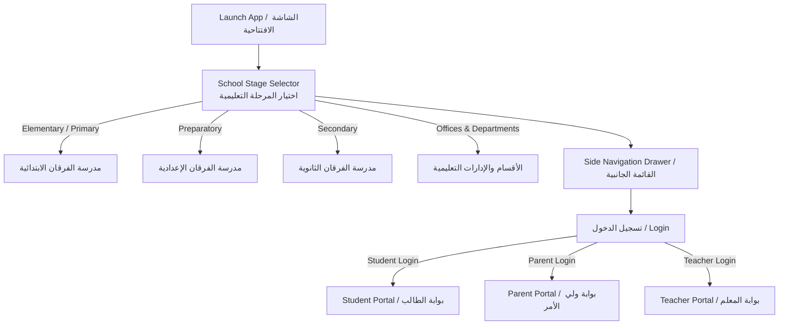
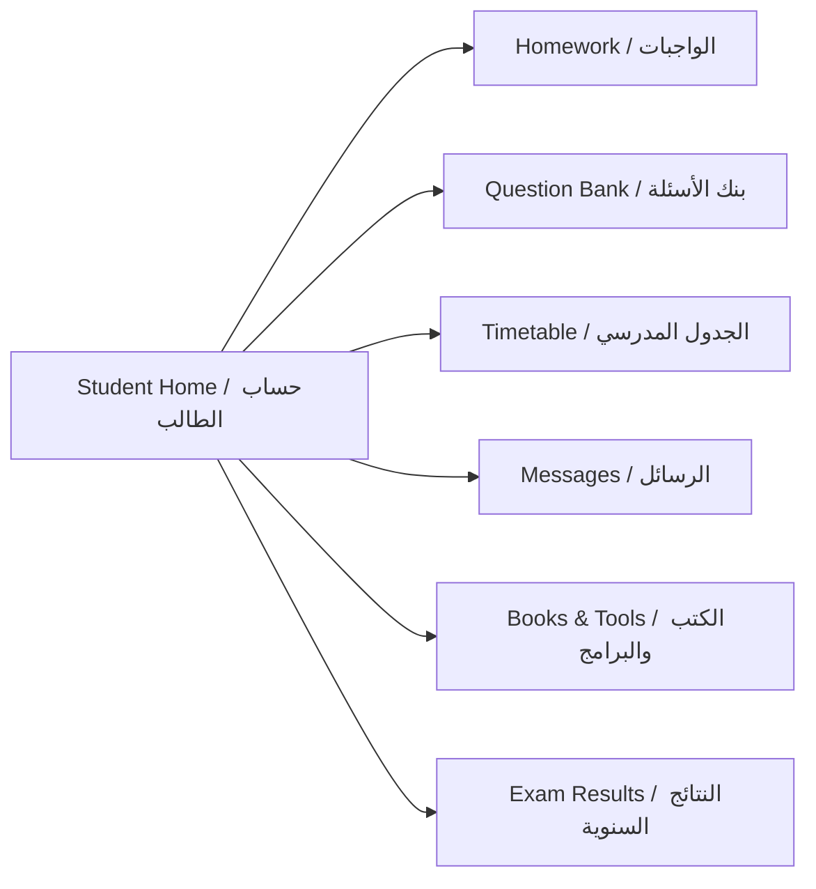
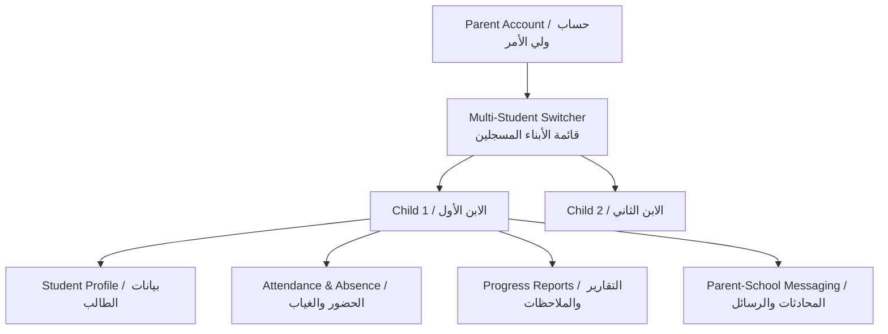
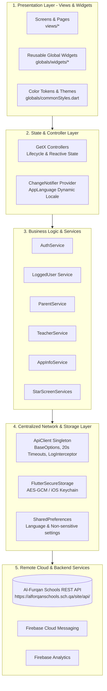
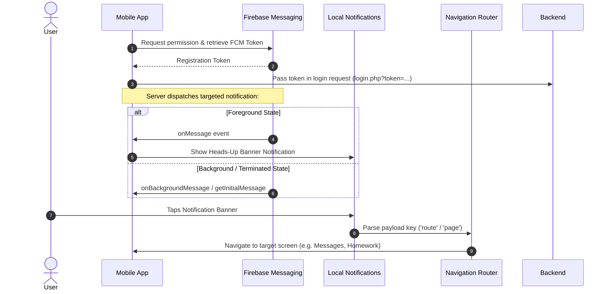

# 🏫 Al-Furqan Private Schools App (تطبيق مدارس الفرقان الخاصة)
### Complete User Manual, Technical Architecture & Cross-Platform Installation Guide (Mac & Windows)

[](https://flutter.dev)
[](https://dart.dev)
[](https://flutter.dev)
[](https://firebase.google.com)
[](pubspec.yaml)
[](https://syncqatar.com)

A state-of-the-art educational community mobile application developed in Flutter for **Al-Furqan Private Schools in Qatar (مدارس الفرقان الخاصة)**. The app bridges the educational ecosystem between school administration, teachers, students, and parents, providing real-time academic tracking, messaging, homework dispatch, timetables, multimedia albums, and prospective student admissions.

---

## 📑 Table of Contents

1. [User Documentation (دليل المستخدم الشامل)](#1-user-documentation-دليل-المستخدم-الشامل)
   - [1.1 Public & Guest Visitors (الزوار والجمهور)](#11-public--guest-visitors-الزوار-والجمهور)
   - [1.2 Student User Guide (دليل الطالب)](#12-student-user-guide-دليل-الطالب)
   - [1.3 Parent User Guide (دليل ولي الأمر)](#13-parent-user-guide-دليل-ولي-الأمر)
   - [1.4 Teacher User Guide (دليل المعلم)](#14-teacher-user-guide-دليل-المعلم)
2. [Complete Installation & Setup Guide for Mac & Laptop](#2-complete-installation--setup-guide-for-mac--laptop)
   - [2.1 macOS Setup Guide (MacBook / iMac / Mac Studio - Apple Silicon M1/M2/M3/M4 & Intel)](#21-macos-setup-guide-macbook--imac--mac-studio---apple-silicon-m1m2m3m4--intel)
   - [2.2 Windows Setup Guide (Laptop & Desktop PC)](#22-windows-setup-guide-laptop--desktop-pc)
   - [2.3 Running & Testing the Application](#23-running--testing-the-application)
   - [2.4 Building Production Binaries (APK, App Bundle, iOS IPA)](#24-building-production-binaries-apk-app-bundle-ios-ipa)
3. [Technical Architecture & System Design](#3-technical-architecture--system-design)
   - [3.1 Layered Architecture Overview](#31-layered-architecture-overview)
   - [3.2 State Management & Controller Strategy](#32-state-management--controller-strategy)
   - [3.3 Centralized Network Layer (`ApiClient`)](#33-centralized-network-layer-apiclient)
   - [3.4 Security Hardening & Encrypted Storage](#34-security-hardening--encrypted-storage)
   - [3.5 Push Notifications & Deep-Link Routing](#35-push-notifications--deep-link-routing)
4. [Complete API & Network Specification](#4-complete-api--network-specification)
   - [4.1 Authentication & Registration](#41-authentication--registration)
   - [4.2 Public Information & Media](#42-public-information--media)
   - [4.3 Student Services API](#43-student-services-api)
   - [4.4 Parent Services API](#44-parent-services-api)
   - [4.5 Teacher Services API](#45-teacher-services-api)
5. [Data Models & Schema Reference](#5-data-models--schema-reference)
6. [Design System & UI Components](#6-design-system--ui-components)
7. [Directory Structure](#7-directory-structure)
8. [Troubleshooting & FAQs](#8-troubleshooting--faqs)
9. [License & Intellectual Property](#9-license--intellectual-property)

---

## 1. User Documentation (دليل المستخدم الشامل)

The application provides specialized dashboards and access levels according to the user's role:



---

### 1.1 Public & Guest Visitors (الزوار والجمهور)

Anyone can use the app without logging in to explore school information, activities, curricula, and apply for admission:

1. **Select School Stage (اختيار المرحلة)**:
   - On launching the app, choose between **Primary (الابتدائية)**, **Preparatory (الإعدادية)**, **Secondary (الثانوية)**, or Educational Departments.
   - Changing the stage updates the entire home dashboard, banners, news feed, and photo galleries to match that specific stage.

2. **Home Dashboard (الرئيسية)**:
   - **Hero Banner Slider**: View latest highlight banners and event announcements.
   - **Latest News & Articles (أحدث الأخبار)**: Tap on any news card to open the complete news article with high-resolution imagery and release timestamps.
   - **Photo & Video Galleries (ألبومات الصور والفيديوهات)**: Browse categorized photo galleries and tap on video cards to watch educational and recreational footage.

3. **Admission & Registration Form (طلب التحاق جديد)**:
   - Accessible via the side drawer.
   - Fill in comprehensive student information: Full name, previous school, mobile number, QID / ID number, date of birth, nationality, residence address, and parent information.
   - Submit the application directly to the registration department with instant status validation.

4. **Curricula & Educational Departments (المناهج والأقسام)**:
   - Read about the school's vision, mission, and the director's address.
   - Browse academic subjects taught at each level and inspect course specifics.

5. **Contact Us & Interactive Maps (تواصل معنا والموقع)**:
   - Launch native turn-by-turn navigation (Google Maps on Android / Apple Maps on iOS) with pre-set GPS coordinates to reach school campuses.
   - Direct links for instant WhatsApp chatting, phone calls, social channels (Instagram, Twitter/X, Facebook, YouTube), and in-app complaint submission.

6. **Language Switcher (تغيير اللغة)**:
   - Toggle seamlessly between Arabic (العربية - RTL) and English (LTR) from the side navigation drawer.

---

### 1.2 Student User Guide (دليل الطالب)

Once logged in with **Student (طالب)** credentials:



1. **Accessing Homework (الواجبات المدرسية)**:
   - Tap **الواجبات** to view a list of all assigned homework.
   - Tap any homework item to view assignment details, teacher notes, deadline, and download attached PDF/worksheet files.

2. **Question Bank (بنك الأسئلة)**:
   - Open **بنك الأسئلة** to access revision materials, sample test questions, and exam preparation sheets organized by subject.

3. **Weekly Timetable (الجدول المدرسي)**:
   - Open **الجدول** to view the daily class schedule, subjects, and period timings for your registered class section.

4. **Electronic Textbooks & Software (الكتب والبرامج الهامة)**:
   - Download official digital PDF textbooks and required educational software applications directly to your mobile device.

5. **Ask Teacher & Messaging (اسأل معلمك والرسائل)**:
   - Submit academic questions directly to specific teachers.
   - Check the **Inbox (الوارد)** to read replies from teachers or administrative notifications.
   - Compose new messages and monitor outgoing threads in the **Sent (المرسلة)** box.

6. **Yearly Results (النتائج المدرسية)**:
   - View official academic report cards and periodic grade assessments securely.

---

### 1.3 Parent User Guide (دليل ولي الأمر)

Designed to give parents a single, unified command center to track all their enrolled children:



1. **Multi-Student Switcher (التبديل بين الأبناء)**:
   - If you have multiple children enrolled in Al-Furqan Schools, tap **قائمة الطلاب** from your dashboard.
   - Select any child to switch the active context immediately without needing to log out and log in again.

2. **Student Profile & Registration Data (بيانات الطالب)**:
   - Review your child's registered grade, class section, student ID, and enrollment status.

3. **Attendance & Absence Monitoring (الغياب والحضور)**:
   - Inspect recorded absences, tardiness, and excused sick leaves in real-time with dates and justification status.

4. **Academic & Behavioral Reports (تقارير الطالب)**:
   - View periodic evaluation reports, teacher observations, academic commendations, or disciplinary notes.

5. **Parent-Teacher Communication (الرسائل)**:
   - Send direct messages to your children's teachers or school management.
   - Receive administrative alerts, meeting notices, and event announcements.

---

### 1.4 Teacher User Guide (دليل المعلم)

Provides instructors with tools for classroom management and communication:

1. **Weekly Teaching Schedule (جدول الحصص)**:
   - View your assigned periods, classes, and subjects across the school week.

2. **Submitting Student Reports (إرسال تقرير)**:
   - Step 1: Select the educational department and stage.
   - Step 2: Select the grade and section level.
   - Step 3: Choose the target student from the auto-populated roster.
   - Step 4: Write evaluation text and submit. The report is instantly delivered to the parent's app.

3. **Homework Dispatch (إرسال ومتابعة الواجبات)**:
   - Create homework assignments, specify instructions and submission deadlines for enrolled classes.

4. **Teacher Messaging (صندوق الرسائل)**:
   - Read incoming inquiries from students and parents.
   - Dispatch responses or broadcast notes to specific students or parents.

---

## 2. Complete Installation & Setup Guide for Mac & Laptop

This guide covers everything required to set up the development environment, install all tools, clone the repository, and run or build the app on both **macOS** and **Windows**.

---

### 2.1 macOS Setup Guide (MacBook / iMac / Mac Studio - Apple Silicon M1/M2/M3/M4 & Intel)

#### System Requirements
- **macOS**: Sonoma (14.x), Sequoia (15.x), or Ventura (13.x).
- **Disk Space**: At least 25 GB of free space.
- **Hardware**: Compatible with Apple Silicon (M1, M2, M3, M4) and Intel x86_64.

---

#### Step 1: Install Homebrew (Mac Package Manager)
Open the **Terminal** app (`Cmd + Space` -> type `Terminal`) and run:
```bash
/bin/bash -c "$(curl -fsSL https://raw.githubusercontent.com/Homebrew/install/HEAD/install.sh)"
```
Follow the on-screen prompts. If you are on Apple Silicon (M1/M2/M3/M4), add Homebrew to your PATH:
```bash
echo 'eval "$(/opt/homebrew/bin/brew shellenv)"' >> ~/.zprofile
eval "$(/opt/homebrew/bin/brew shellenv)"
```

---

#### Step 2: Install Git & Java Development Kit (JDK 17)
```bash
brew install git
brew install openjdk@17
```
Link JDK 17 to your system path:
```bash
sudo ln -sfn /opt/homebrew/opt/openjdk@17/libexec/openjdk.jdk /Library/Java/JavaVirtualMachines/openjdk-17.jdk
echo 'export JAVA_HOME=$(/usr/libexec/java_home -v 17)' >> ~/.zshrc
source ~/.zshrc
```
Verify Java installation:
```bash
java -version
```

---

#### Step 3: Install Flutter SDK
1. Download the Flutter SDK using Homebrew:
   ```bash
   brew install --cask flutter
   ```
   *Or download manually from [flutter.dev](https://docs.flutter.dev/get-started/install/macos) and extract to `~/development/flutter`.*

2. Add Flutter to your PATH (if installed manually):
   ```bash
   echo 'export PATH="$PATH:$HOME/development/flutter/bin"' >> ~/.zshrc
   source ~/.zshrc
   ```

3. Run Flutter Doctor:
   ```bash
   flutter doctor
   ```

---

#### Step 4: Setup Xcode & iOS Simulator (For iOS Development)
1. Install **Xcode** from the Mac App Store (version 15 or 16).
2. Configure Xcode Command Line Tools:
   ```bash
   sudo xcode-select --switch /Applications/Xcode.app/Contents/Developer
   sudo xcodebuild -runFirstLaunch
   ```
3. Accept the Xcode License Agreement:
   ```bash
   sudo xcodebuild -license accept
   ```
4. Install **CocoaPods** (iOS dependency manager):
   ```bash
   sudo gem install cocoapods
   ```
   *(Or on Apple Silicon with Homebrew: `brew install cocoapods`)*
5. Open an iOS Simulator:
   ```bash
   open -a Simulator
   ```

---

#### Step 5: Setup Android Studio (For Android Development on Mac)
1. Download and install **Android Studio** for Mac:
   ```bash
   brew install --cask android-studio
   ```
2. Open Android Studio -> **Settings / Preferences** -> **Languages & Frameworks** -> **Android SDK**:
   - In **SDK Platforms**: Check **Android 15 (VanillaIceCream - API 35)** and **Android 14 (API 34)**.
   - In **SDK Tools**: Check **Android SDK Command-line Tools (latest)**, **Android SDK Build-Tools**, and **Android Emulator**.
3. Accept Android Licenses in Terminal:
   ```bash
   flutter doctor --android-licenses
   ```
   *(Press `y` to accept each agreement)*

---

#### Step 6: Clone and Configure the Project
1. Clone the repository:
   ```bash
   git clone https://github.com/AhmedElbasha97/al_furqan_school.git
   cd al_furqan_school
   ```

2. Fetch all Dart dependencies:
   ```bash
   flutter pub get
   ```

3. Install iOS CocoaPods dependencies:
   ```bash
   cd ios
   pod install --repo-update
   cd ..
   ```

---

### 2.2 Windows Setup Guide (Laptop & Desktop PC)

#### System Requirements
- **OS**: Windows 10 or Windows 11 (64-bit).
- **Disk Space**: At least 25 GB of free space.
- **PowerShell**: Version 5.0 or higher (pre-installed on Windows 10/11).

---

#### Step 1: Install Git for Windows
1. Download Git from [git-scm.com](https://git-scm.com/download/win).
2. Run the installer and keep all default settings selected (ensure *"Git from the command line and also from 3rd-party software"* is enabled).

---

#### Step 2: Install Java Development Kit (JDK 17)
1. Download Microsoft OpenJDK 17 or Oracle JDK 17 (x64 MSI Installer) from [Microsoft OpenJDK](https://learn.microsoft.com/en-us/java/openjdk/download#openjdk-17).
2. Install the package.
3. Configure `JAVA_HOME` environment variable:
   - Press `Win + S` -> Type **Environment Variables** -> Open **Edit the system environment variables**.
   - Click **Environment Variables...**.
   - Under **System Variables**, click **New**:
     - Variable name: `JAVA_HOME`
     - Variable value: `C:\Program Files\Microsoft\jdk-17.0.x.x-hotspot` (or your JDK installation path).
   - Under **System Variables**, select `Path` -> Click **Edit** -> Click **New** -> Add `%JAVA_HOME%\bin`.

---

#### Step 3: Install Flutter SDK on Windows
1. Download the Flutter Windows SDK zip bundle from [flutter.dev](https://docs.flutter.dev/get-started/install/windows/mobile).
2. Extract the archive to `C:\src\flutter` (⚠️ *Do NOT install Flutter in `C:\Program Files\` as it requires elevated privileges*).
3. Add Flutter to your User `Path`:
   - In **Environment Variables** -> under **User variables for [User]**, select `Path` -> click **Edit**.
   - Click **New** -> type `C:\src\flutter\bin` -> click **OK**.
4. Open a new **PowerShell** or **Command Prompt** window and verify:
   ```powershell
   flutter --version
   flutter doctor
   ```

---

#### Step 4: Install Android Studio & Android SDK
1. Download Android Studio from [developer.android.com/studio](https://developer.android.com/studio).
2. Run the installer and check both **Android Studio** and **Android Virtual Device**.
3. Launch Android Studio -> Click **More Actions** -> **SDK Manager**:
   - **SDK Platforms**: Check **Android 15 (API 35)** and **Android 14 (API 34)**.
   - **SDK Tools**: Check **Android SDK Command-line Tools (latest)**, **Android SDK Platform-Tools**, **Android SDK Build-Tools**, and **Android Emulator**.
   - Click **Apply** to download.
4. Create an Android Emulator:
   - In Android Studio -> **More Actions** -> **Virtual Device Manager**.
   - Click **Create Device** -> Select **Pixel 8 Pro** -> Download system image (e.g. **API 34 or 35**) -> Click **Finish**.
5. Accept Android Licenses:
   ```powershell
   flutter doctor --android-licenses
   ```
   *(Type `y` to accept each license)*

---

#### Step 5: Clone and Setup Project on Windows
1. Open PowerShell and navigate to your workspace directory:
   ```powershell
   cd C:\Users\<YourUsername>\Desktop
   git clone https://github.com/AhmedElbasha97/al_furqan_school.git
   cd al_furqan_school
   ```

2. Download all dependencies:
   ```powershell
   flutter pub get
   ```

3. Run verification tests:
   ```powershell
   flutter test
   ```

---

### 2.3 Running & Testing the Application

#### 1. Check Available Devices & Emulators
```bash
flutter devices
```
*Output will list connected physical phones, open simulators, emulators, and Chrome.*

#### 2. Launch on a Connected Device / Emulator
```bash
# Run on default connected device
flutter run

# Run on a specific device
flutter run -d <DEVICE_ID>

# Example: Run on iOS Simulator
flutter run -d "iPhone 16 Pro"

# Example: Run on Android Emulator
flutter run -d emulator-5554
```

#### 3. Useful Hotkeys during Debugging:
- Press `r` -> **Hot Reload** (instant UI update without losing state).
- Press `R` -> **Hot Restart** (re-initializes app state).
- Press `h` -> Show list of all debugging commands.
- Press `q` -> Quit debugging session.

---

### 2.4 Building Production Binaries (APK, App Bundle, iOS IPA)

#### A. Android Release APK (for Direct Sideloading & Testing)
```bash
flutter build apk --release
```
- **Generated File**: `build/app/outputs/flutter-apk/app-release.apk`
- For debug testing without signing keys:
  ```bash
  flutter build apk --debug
  ```
  *Output:* `build/app/outputs/flutter-apk/app-debug.apk`

#### B. Android App Bundle (AAB - for Google Play Store Upload)
```bash
flutter build appbundle --release
```
- **Generated File**: `build/app/outputs/bundle/release/app-release.aab`

#### C. iOS Archive & IPA (for Apple App Store / TestFlight)
*(Requires macOS with Xcode and an active Apple Developer Program account)*

```bash
# Step 1: Build iOS Release Archive
flutter build ipa --release

# Step 2: Open the generated archive in Xcode Organizer for distribution
open ios/Runner.xcworkspace
```
Inside Xcode:
1. Select **Product** -> **Archive**.
2. When the Organizer window opens, click **Distribute App**.
3. Select **App Store Connect** (or **Ad Hoc** / **Development**) and follow the signing workflow.

---

## 3. Technical Architecture & System Design

### 3.1 Layered Architecture Overview

The codebase is engineered with strict separation of concerns into distinct architectural tiers:



---

### 3.2 State Management & Controller Strategy

1. **GetX (`GetxController` / `GetBuilder`)**:
   - Manages state, API loading triggers, validation, and lifecycle hooks (`onInit`, `onClose`) for each feature.
   - Kept close to their views inside `views/<feature>/controller/<feature>_controller.dart`.
   - Explicit method return types (`Future<void>`, `Future<bool>`) ensure robust type safety and zero static analysis warnings.

2. **Provider (`ChangeNotifier` / `ChangeNotifierProvider`)**:
   - Manages root-level **dynamic language switching** (`AppLanguage` in `lib/I10n/AppLanguage.dart`).
   - Persists selected locale (`ar` or `en`) across app restarts.

3. **Clean Controller Lifecycle**:
   - Controllers implement proper disposal for text controllers and animation controllers to eliminate memory leaks:
     ```dart
     @override
     void onClose() {
       usernameController.dispose();
       passwordController.dispose();
       super.onClose();
     }
     ```

---

### 3.3 Centralized Network Layer (`ApiClient`)

All HTTP communication passes through the singleton `ApiClient` (`lib/services/api_client.dart`):

```dart
class ApiClient {
  ApiClient._internal();
  static final ApiClient instance = ApiClient._internal();

  late final Dio dio = Dio(
    BaseOptions(
      baseUrl: baseUrl, // https://alforqanschools.sch.qa/site/api/
      connectTimeout: const Duration(seconds: 20),
      receiveTimeout: const Duration(seconds: 20),
      sendTimeout: const Duration(seconds: 20),
      responseType: ResponseType.json,
      headers: {
        'Accept': 'application/json',
        'Content-Type': 'application/json',
      },
    ),
  );
}
```

#### Key Advantages:
- **Resilience**: 20-second connection and socket timeouts prevent screens from hanging indefinitely on weak cellular connections.
- **Logging**: Detailed request and response telemetry output in `kDebugMode` via `LogInterceptor`.
- **Clean Parameter Mapping**: Replaces unsafe string URL concatenation with structured `queryParameters: {...}` maps.

---

### 3.4 Security Hardening & Encrypted Storage

#### Credential Encryption
To support multi-student account switching without requiring parents to re-enter their password, parent credentials are saved using **`flutter_secure_storage`**:
- **Android**: Secured with hardware-backed Keystore and `EncryptedSharedPreferences` (AES-256 GCM).
- **iOS**: Secured inside the **Apple Keychain** with `first_unlock` accessibility.
- **Sign-out**: Invoking `AuthService.clearSecureCredentials()` completely wipes the secure enclave storage.

---

### 3.5 Push Notifications & Deep-Link Routing

Managed via `FirebaseMessaging` and `flutter_local_notifications` in `lib/services/notification.dart`:



---

## 4. Complete API & Network Specification

**Base URL**: `https://alforqanschools.sch.qa/site/api/`  
**Web Domain**: `https://www.alrayyanprivateschools.com`  
**Network Client**: `Dio` (v5.11.0) via `ApiClient`

---

### 4.1 Authentication & Registration

| Endpoint | Method | Parameters | Description |
| :--- | :--- | :--- | :--- |
| `login.php` | `GET` | `type` (`STUDENT`, `PARENTS`, `TEACHER`), `username`, `password`, `token` (FCM) | Authenticates user and returns user info (ID, name, class). |
| `application.php` | `POST` | `exp_fname`, `exp_email`, `exp_preschool`, `exp_mob`, `exp_date`, `exp_idstudent`, `exp_birthdate`, `exp_type`, `exp_religion`, `exp_birthplace`, `exp_nationalty`, `exp_citybrth`, `exp_provincebrth`, `exp_registnum`, `exp_address`, `exp_city`, `exp_zipcode`, `exp_tels`, `exp_year`, `exp_registstatus`, `exp_pname`, `exp_relation`, `exp_pjob`, `exp_notes` | Submits a new student admission request. |

---

### 4.2 Public Information & Media

| Endpoint | Method | Parameters | Description |
| :--- | :--- | :--- | :--- |
| `slide.php` | `GET` | `school_type` (Optional) | Fetches hero banner slideshow images. |
| `slide_app.php` | `GET` | *None* | Fetches main portal slider images. |
| `office_department_app.php` | `GET` | *None* | Lists administrative offices and educational departments. |
| `office_department_app_articles.php` | `GET` | `dep_id` | Returns details, description, and articles of a specific department. |
| `about.php` | `GET` | *None* | Fetches school overview and history. |
| `about_app.php` | `GET` | *None* | Fetches information about the app and creators. |
| `school_desc.php` | `GET` | *None* | Returns the principal/director's address. |
| `news.php` | `GET` | `school_type` | Retrieves latest news articles list. |
| `news_view.php` | `GET` | `school_type`, `news_id` | Retrieves full content and metadata for a specific news article. |
| `gallery.php` | `GET` | `school_type` / `gid` | Lists photo gallery albums or photos within an album. |
| `videos.php` | `GET` | `school_type` | Lists video gallery items and video links. |
| `subjects.php` | `GET` | *None* | Returns curricula and subject categories. |
| `art.php` | `GET` | `dep_id` | Returns subject specifics and curriculum content. |
| `privacy.php` | `GET` | *None* | Returns school privacy policy text. |
| `agreament.php` | `GET` | *None* | Returns terms and conditions text. |
| `social.php` | `GET` | *None* | Returns school social media links (FB, Instagram, Twitter, Snapchat, WhatsApp). |
| `contact.php` | `POST` | `name`, `email`, `subject`, `message`, `mobile` | Submits feedback, inquiries, or complaints. |

---

### 4.3 Student Services API

| Endpoint | Method | Parameters | Description |
| :--- | :--- | :--- | :--- |
| `student_download_files.php` | `GET` | `student_id` | Lists electronic downloadable course files. |
| `student_download_files_view.php` | `GET` | `student_id`, `file_id` | Fetches details and download URL of a specific file. |
| `student_homework.php` | `GET` | `student_id` | Lists homework assignments assigned to the student. |
| `student_homework_view.php` | `GET` | `student_id`, `homework_id` | Fetches full assignment description and attached files. |
| `student_quest_bank.php` | `GET` | `student_id` | Lists questions available in the question bank. |
| `student_quest_bank_view.php` | `GET` | `student_id`, `file_id` | Returns specific question details and answers. |
| `student_prog.php` | `GET` | `student_id` | Lists important programs and digital tools for students. |
| `student_books.php` | `GET` | `student_id` | Lists digital textbooks and study references. |
| `student_ask_income.php` | `GET` | `student_id` | Returns questions asked by the student and teacher replies. |
| `student_ask_income_view.php` | `GET` | `student_id`, `msg_id` | Full thread view of an asked question. |
| `sch.php` | `GET` | `class_id` | Retrieves weekly class timetable and schedule. |
| `student_msg_income.php` | `GET` | `student_id` | Incoming message inbox for the student. |
| `student_msg_sent.php` | `GET` | `student_id` | Outbox of sent student messages. |
| `student_msg_send.php` | `POST` | `student_id`, `sendto_type`, `teacher_id`, `title`, `text` | Dispatches a message to a teacher. |

---

### 4.4 Parent Services API

| Endpoint | Method | Parameters | Description |
| :--- | :--- | :--- | :--- |
| `parent_report_about.php` | `GET` | `parent_id` | Lists student evaluation and progress reports. |
| `parent_report_about_view.php` | `GET` | `parent_id`, `report_id` | Detailed evaluation report breakdown. |
| `parent_absence.php` | `GET` | `parent_id` | Student attendance logs and absence records. |
| `student_info.php` | `GET` | `student_id` | Retrieves student profile, registration number, and stage info. |
| `parent_msg_income.php` | `GET` | `parent_id` | Inbox messages received from teachers or administration. |
| `parent_msg_income_view.php` | `GET` | `parent_id`, `msg_id` | Content of an incoming message. |
| `parent_msg_send.php` | `POST` | `parent_id`, `sendto_type`, `teacher_id`, `title`, `text` | Dispatches a message to a teacher or administration. |
| `parent_msg_sent.php` | `GET` | `parent_id` | Outbox messages sent by the parent. |
| `parent_msg_sent_view.php` | `GET` | `parent_id`, `msg_id` | Content of a sent message. |
| `teachers_list.php` | `POST` | *None* | Returns list of teachers for message recipient selection. |

---

### 4.5 Teacher Services API

| Endpoint | Method | Parameters | Description |
| :--- | :--- | :--- | :--- |
| `teacher_reports.php` | `GET` | `teacher_id` | Lists student reports created by the teacher. |
| `teacher_report_view.php` | `GET` | `teacher_id`, `report_id` | Details of a submitted report. |
| `teacher_report_add.php` | `POST` | `teacher_id`, `student_id`, `date`, `text` | Submits a new evaluation report for a student. |
| `categories_list.php` | `GET` | `ctg_id` (Optional) | Returns stages, grades, and section levels. |
| `student_list.php` | `GET` | `class_id` | Lists students enrolled in a specific class. |
| `teacher_homework.php` | `GET` | `teacher_id` | Lists homework tasks created by the teacher. |
| `teacher_homework_view.php` | `GET` | `teacher_id`, `homework_id` | Details of homework submission. |
| `teacher_quest_bank.php` | `GET` | `teacher_id` | Question bank repository managed by the teacher. |
| `teacher_msg_sent.php` | `GET` | `teacher_id` | Sent message outbox for the teacher. |
| `teacher_msg_send.php` | `POST` | `teacher_id`, `sendto_type`, `to_id`, `title`, `text` | Sends a message to a student or parent. |
| `teacher_msg_sent_view.php` | `GET` | `teacher_id`, `msg_id` | Details of a sent message. |
| `teacher_table.php` | `GET` | `teacher_id` | Retrieves weekly teaching schedule. |

---

## 5. Data Models & Schema Reference

All data serialization logic is centralized under `lib/models/`:

```
lib/models/
├── AppInfo/
│   ├── aboutSchool.dart       # General single-record text container (title, content)
│   ├── News.dart              # News list item model
│   ├── newsDetails.dart       # Detailed news article model
│   ├── photo.dart & photoAlbum.dart  # Photo galleries and album items
│   ├── sliderPhotos.dart      # Hero slider banner model
│   ├── subject.dart           # Subject entity
│   ├── subjectDetails.dart    # Subject article details
│   └── videos.dart            # Video album entry
├── new/
│   ├── department_model.dart  # Department list model
│   ├── departmen_detail_model.dart # Department info and sub-items
│   ├── student_list_model.dart# Parent's multi-student directory
│   ├── student_info_model.dart# Student profile information
│   ├── social_link.dart       # Social URLs (FB, Twitter, WhatsApp, App stores)
│   └── slide_show_model.dart  # Slide show image metadata
├── parents/
│   ├── attendance.dart        # Attendance & absence record
│   ├── reports.dart           # Evaluation report summary
│   └── reportDetails.dart     # Detailed evaluation criteria
├── Student/
│   ├── AskedQuestion.dart     # Question submitted to teacher
│   ├── AskedQuestionDetails.dart # Threaded answer from teacher
│   ├── book.dart              # Textbook reference
│   └── scedules_model.dart    # Timetable days and period schedule
└── teacher/
    ├── category.dart          # Academic categories and grade levels
    ├── homeWork.dart          # Teacher-side homework record
    ├── HomeWorkDetails.dart   # Teacher-side homework details
    ├── questionBank.dart      # Teacher-side question bank entry
    ├── student.dart           # Student selection model
    └── teacherReport.dart     # Teacher evaluation report record
```

---

## 6. Design System & UI Components

### Color Tokens ([`lib/globals/commonStyles.dart`](lib/globals/commonStyles.dart))

| Token Name | Hex Code | Visual Preview | Description |
| :--- | :--- | :---: | :--- |
| `mainColor` | `#8A1538` |  | Primary Brand Maroon (Qatar National Color) |
| `white` | `#F5EEDC` |  | Warm Cream background for cards & scaffolds |
| `teal` | `#97BFB4` |  | Secondary accent for buttons, borders & tags |
| `mainTextColor` | `#0C1F38` |  | High-contrast dark navy body text |
| `brandColor` | `#7E2670` |  | Accent purple for banners & highlights |

### Typography
- **Font Family**: `DroidKufi` (`DroidKufiRegular.ttf`, `DroidKufiBold.ttf`) registered in `pubspec.yaml`.
- Optimized for Arabic typography (Kufic Calligraphy style) with full English fallback glyphs.

---

## 7. Directory Structure

```
al_furqan_school/
├── android/                     # Android Gradle build configuration & native code
│   ├── app/build.gradle         # App-level build config (Desugaring, Signing, SDK 35)
│   ├── build.gradle             # Top-level Gradle configuration (AGP 8.11.1)
│   └── settings.gradle          # Plugin loader & dependency repositories
├── ios/                         # iOS Xcode project, Podfile & capabilities
├── assets/
│   ├── fonts/                   # DroidKufi font assets
│   └── images/                  # School logos, banners, placeholders
├── i18n/
│   ├── ar.json                  # Arabic localized strings
│   └── en.json                  # English localized strings
├── lib/
│   ├── firebase_options.dart    # Firebase credentials & options
│   ├── main.dart                # Application entrypoint & theme setup
│   ├── I10n/                    # Localization delegate & AppLanguage provider
│   ├── globals/
│   │   ├── CommonSetting.dart   # API Base URLs
│   │   ├── commonStyles.dart    # Design tokens & color constants
│   │   ├── helpers.dart         # Connectivity checkers & dialog utilities
│   │   └── widgets/             # Reusable UI widgets (Drawer, Cards, Buttons, Inputs)
│   ├── models/                  # JSON Data models
│   ├── services/                # API integration services & ApiClient singleton
│   └── views/                   # UI Screens & GetX controllers
│       ├── startScreens/        # Stage selector
│       ├── homescreen/          # Main dashboard
│       ├── auth/login/          # Multi-role login screen
│       ├── loggedUser/          # Student portal
│       ├── parents/             # Parent portal
│       ├── teacher/             # Teacher portal
│       ├── Student/             # Schedules, books & asked questions
│       ├── appData/             # News, about, terms & privacy views
│       └── other/               # Admissions & multimedia albums
├── test/
│   └── widget_test.dart         # Flutter unit & widget tests
├── pubspec.yaml                 # Dependencies & asset declarations
└── README.md                    # This complete documentation manual
```

---

## 8. Troubleshooting & FAQs

| Symptom / Error | Root Cause | Solution |
| :--- | :--- | :--- |
| **`CocoaPods could not find compatible versions`** (Mac) | Outdated local pod specs repository | Run: `cd ios && pod repo update && pod install && cd ..` |
| **`Cannot convert 'null' to File`** (Android) | Missing `key.properties` during release evaluation | Fixed in `android/app/build.gradle`: Release signing config checks file existence and falls back to debug signing if not configured. |
| **`Unsupported Android Gradle Plugin version`** | Older AGP version | We have upgraded AGP to **8.11.1** and Gradle to **9.2**. Ensure JDK 17 is active. |
| **`Android licenses not accepted`** | Fresh Android SDK install | Run `flutter doctor --android-licenses` and accept all prompts (`y`). |
| **Push notifications not received** | Missing or mismatched Firebase config | Ensure `google-services.json` is placed in `android/app/` and `GoogleService-Info.plist` is in `ios/Runner/`. |
| **No internet / Connection Timeout** | Network unreachable or slow connection | `ApiClient` enforces 20s timeouts with built-in retry dialogs. Check device Wi-Fi/cellular connection. |

---

## 9. License & Intellectual Property

Copyright © **Al-Furqan Private Schools (مدارس الفرقان الخاصة - دولة قطر)** & **Sync Qatar**.  
All rights reserved. Unauthorized copying, modification, distribution, or reverse engineering of this software is strictly prohibited.
