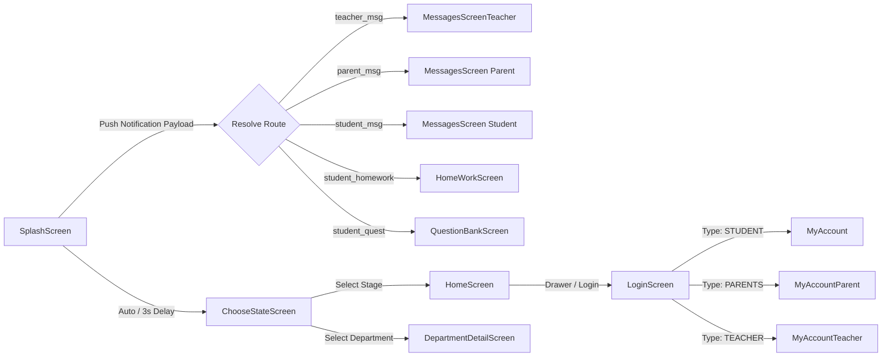
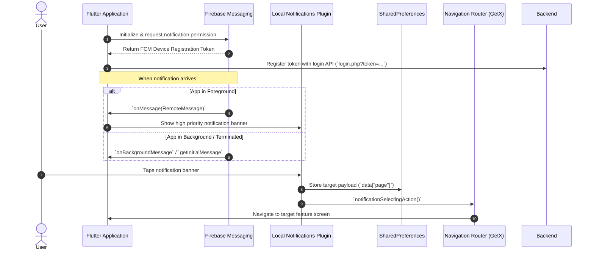

# 🏫 Al-Furqan Private Schools App (تطبيق مدارس الفرقان الخاصة)
### Complete Project Documentation, Architecture & Installation Manual

[](https://flutter.dev)
[](https://dart.dev)
[](https://flutter.dev)
[](https://firebase.google.com)
[](pubspec.yaml)
[](https://syncqatar.com)

A comprehensive cross-platform mobile application built with Flutter for **Al-Furqan Private Schools in Qatar (مدارس الفرقان الخاصة)**. The platform serves prospective students, visitors, and provides specialized portals for **Students**, **Parents**, and **Teachers**.

---

## 📑 Table of Contents

1. [System Overview & Architecture](#1-system-overview--architecture)
2. [Features by User Role](#2-features-by-user-role)
   - [Public / Guest Visitors](#public--guest-visitors)
   - [Student Portal](#student-portal)
   - [Parent Portal](#parent-portal)
   - [Teacher Portal](#teacher-portal)
3. [State Management & Navigation Flow](#3-state-management--navigation-flow)
4. [Complete API & Network Specification](#4-complete-api--network-specification)
5. [Data Models Specification](#5-data-models-specification)
6. [Push Notification & Deep-Linking Lifecycle](#6-push-notification--deep-linking-lifecycle)
7. [Design System, Typography & Global Widgets](#7-design-system-typography--global-widgets)
8. [Project Architecture & Directory Structure](#8-project-architecture--directory-structure)
9. [Prerequisites](#9-prerequisites)
10. [Installation & Setup](#10-installation--setup)
11. [Firebase Configuration](#11-firebase-configuration)
12. [Running the Project](#12-running-the-project)
13. [Building for Production](#13-building-for-production)
    - [Android (APK & App Bundle)](#android-apk--app-bundle)
    - [iOS (IPA & Archive)](#ios-ipa--archive)
14. [Configuration & Customization](#14-configuration--customization)
15. [Security Analysis & Data Protection](#15-security-analysis--data-protection)
16. [Developer Guide & Contribution Workflows](#16-developer-guide--contribution-workflows)
17. [Troubleshooting & FAQs](#17-troubleshooting--faqs)
18. [License & Intellectual Property](#18-license--intellectual-property)

---

## 1. System Overview & Architecture

The application is structured around a modular, reactive architecture separating the **Presentation Layer (UI)**, **State Management / Controller Layer**, **Service / Network Layer**, and **Cloud Integration Layer**.

```mermaid
graph TD
    subgraph UI_Layer [Presentation / UI Layer]
        V_Start[Start & School Level Selector]
        V_Home[Home Landing Dashboard]
        V_Student[Student Portal Views]
        V_Parent[Parent Portal Views]
        V_Teacher[Teacher Portal Views]
        V_App[Public Info Views]
    end

    subgraph State_Layer [State Management & Controller Layer]
        C_GetX[GetxControllers & GetBuilders]
        C_Provider[ChangeNotifier Provider - AppLanguage]
    end

    subgraph Service_Layer [Service & Network Layer]
        S_Auth[AuthService]
        S_Logged[LoggedUserService]
        S_Parent[ParentService]
        S_Teacher[TeacherService]
        S_AppInfo[AppInfoService]
        S_Start[StarScreenServices]
        S_Join[JoinApplicationService]
        S_Contact[ContactUsService]
        S_Notif[PushNotificationService]
    end

    subgraph Data_Layer [Data & Storage Layer]
        M_Models[Data Models JSON Serializers]
        SP[SharedPreferences Local Storage]
        DioClient[Dio HTTP Client]
    end

    subgraph Remote_Layer [External & Cloud Services]
        BackendAPI[(Al-Furqan School PHP API)]
        FirebaseFCM[Firebase Cloud Messaging]
        FirebaseAnalytics[Firebase Analytics]
        MapsService[Apple Maps / Google Maps]
    end

    UI_Layer --> State_Layer
    State_Layer --> Service_Layer
    Service_Layer --> Data_Layer
    Data_Layer --> Remote_Layer
```



### Architectural Highlights
* **Presentation**: Modular `StatelessWidget` and `StatefulWidget` instances bound to `GetxController` states.
* **Business Logic**: Controllers located alongside views (`views/<module>/controller/<module>_controller.dart`).
* **Service Layer**: Dedicated service classes in `lib/services/` handling REST/JSON HTTP communications via `Dio`.
* **Local Persistence**: `SharedPreferences` manages user tokens, session IDs, active role flags, cached route redirects, and language preferences.

---

## 2. Features by User Role

```mermaid
graph TD
    User([App User]) --> Role{User Type}
    
    Role -->|Public / Guest| GuestFlow[Guest Features]
    GuestFlow --> G1[School Level Switcher<br/>Primary / Prep / Secondary]
    GuestFlow --> G2[Home News & SlideShow]
    GuestFlow --> G3[Photo & Video Albums]
    GuestFlow --> G4[Join Application Form]
    GuestFlow --> G5[Curricula & School Info]
    
    Role -->|Student| StudentFlow[Student Portal]
    StudentFlow --> S1[Homework & Assignments]
    StudentFlow --> S2[Question Bank]
    StudentFlow --> S3[Study Schedules]
    StudentFlow --> S4[Ask Teacher & Messages]
    StudentFlow --> S5[Course Books & Downloads]
    StudentFlow --> S6[Academic Results]

    Role -->|Parent| ParentFlow[Parent Portal]
    ParentFlow --> P1[Multi-Student Switcher]
    ParentFlow --> P2[Student Profiles]
    ParentFlow --> P3[Academic & Behavior Reports]
    ParentFlow --> P4[Attendance & Absence Logs]
    ParentFlow --> P5[Parent-School Messaging]

    Role -->|Teacher| TeacherFlow[Teacher Portal]
    TeacherFlow --> T1[Class Teaching Schedules]
    TeacherFlow --> T2[Issue Student Reports]
    TeacherFlow --> T3[Homework Dispatch]
    TeacherFlow --> T4[Question Bank]
    TeacherFlow --> T5[Teacher Messaging Inbox & Sent]
```



### Public / Guest Visitors
* **Multi-Stage School Selection**: Switch between **Elementary (الابتدائية)**, **Preparatory (الاعدادية)**, and **Secondary (الثانوية)** schools, as well as educational department hubs.
* **School Overview**: Vision, mission statement, Director's address, and general information.
* **News & Announcements**: Interactive news feed with details view and banner sliders.
* **Photo & Video Galleries**: Categorized multimedia albums and video streaming.
* **Curricula & Subjects**: Information on school curriculum and educational subjects.
* **Online Admission Form (طلب إلتحاق)**: Digital application for prospective students with validation.
* **Contact & Location**: Interactive maps integration (`map_launcher`) pointing to school coordinates, direct WhatsApp links, social media channels, and complaint submission.
* **Bilingual Support**: Full Arabic (RTL) and English language toggling.

### Student Portal
* **Homework & Assignments (الواجبات المدرسية)**: View assigned homework, descriptions, due dates, and attachment files.
* **Question Bank (بنك الأسئلة)**: Access subject-specific questions and exam prep materials.
* **Class Timetables & Schedules (الجدول المدرسي)**: View class schedules and periods.
* **Electronic Files & Important Tools (الملفات والبرامج)**: Download school files, resources, and documents.
* **Ask Teacher (اسئلة للطلاب)**: Submit academic questions to instructors and receive responses.
* **Messaging (الرسائل)**: Inbox, sent messages, and direct messaging to teachers and administration.
* **Academic Results (النتائج)**: Direct portal access to annual grades and report cards.

### Parent Portal
* **Multi-Student Switcher (قائمة الطلاب)**: Seamlessly toggle between multiple registered children under a single parent account.
* **Student Profile (بيانات الطالب)**: View student information, class, registration status, and details.
* **Academic & Behavioral Reports (التقارير)**: Real-time progress and evaluation reports issued by teachers.
* **Attendance & Absence Logs (الغياب والحضور)**: Live tracking of student attendance and recorded absences.
* **Parent-School Messaging**: Direct communication channel with teachers and administration.

### Teacher Portal
* **Student Evaluation Reports (إرسال تقرير)**: Filter by educational level, class, and student to issue progress reports.
* **Homework Dispatch (الواجبات)**: Create and monitor homework tasks for assigned classes.
* **Question Bank Management**: Manage subject question repositories.
* **Teaching Schedule (جدول الحصص)**: Weekly schedule of teaching periods.
* **Teacher Messaging**: Communicate directly with students and parents.

---

## 3. State Management & Navigation Flow

### State Management Patterns
1. **GetX (`GetxController` / `GetBuilder`)**:
   * Used across feature screens for lifecycle management (`onInit`, `onClose`), form state handling, and view updates via `update()`.
   * Examples: `HomeScreenController`, `LoginController`, `StartScreen`, `ReportController`, `StudentInfoController`.
2. **Provider (`ChangeNotifierProvider` / `ChangeNotifier`)**:
   * Used for root-level **dynamic language switching** (`AppLanguage` in [`lib/I10n/AppLanguage.dart`](lib/I10n/AppLanguage.dart)).
3. **Local State (`StatefulWidget` / `setState`)**:
   * Used in standalone widgets and account home screens (`SplashScreen`, `MyAccount`, `MyAccountParent`, `MyAccountTeacher`, `AppDrawer`).

### Navigation & Routing Map



---

## 4. Complete API & Network Specification

**Base URL**: `https://alforqanschools.sch.qa/site/api/`  
**Web Domain**: `https://www.alrayyanprivateschools.com`  
**Network Client**: `Dio` (v5.9.1)

### 4.1 Authentication & Registration API
| Endpoint | Method | Parameters | Description |
| :--- | :--- | :--- | :--- |
| `login.php` | `GET` | `type` (`STUDENT`, `PARENTS`, `TEACHER`), `username`, `password`, `token` (FCM) | Authenticates user and returns user info (ID, name, class). |
| `application.php` | `GET` | `exp_fname`, `exp_email`, `exp_preschool`, `exp_mob`, `exp_date`, `exp_idstudent`, `exp_birthdate`, `exp_type`, `exp_religion`, `exp_birthplace`, `exp_nationalty`, `exp_citybrth`, `exp_provincebrth`, `exp_registnum`, `exp_address`, `exp_city`, `exp_zipcode`, `exp_tels`, `exp_year`, `exp_registstatus`, `exp_pname`, `exp_relation`, `exp_pjob`, `exp_notes` | Submits a new student admission request. |

### 4.2 Public & School Information API
| Endpoint | Method | Parameters | Description |
| :--- | :--- | :--- | :--- |
| `slide.php` | `GET` | `school_type` (Optional) | Fetches hero banner slideshow images for home. |
| `slide_app.php` | `GET` | *None* | Fetches main portal slider images. |
| `office_department_app.php` | `GET` | *None* | Lists administrative offices and educational departments. |
| `office_department_app_articles.php` | `GET` | `dep_id` | Returns details, description, and articles of a specific department. |
| `about.php` | `GET` | *None* | Fetches school overview and history. |
| `about_app.php` | `GET` | *None* | Fetches information about the app and creators. |
| `school_desc.php` | `GET` | *None* | Returns the principal/director's address. |
| `news.php` | `GET` | `school_type` | Retrieves latest news articles list. |
| `news_view.php` | `GET` | `school_type`, `news_id` | Retrieves full content and metadata for a specific news article. |
| `subjects.php` | `GET` | *None* | Returns curricula and subject categories. |
| `art.php` | `GET` | `dep_id` | Returns subject specifics and curriculum content. |
| `privacy.php` | `GET` | *None* | Returns school privacy policy text. |
| `agreament.php` | `GET` | *None* | Returns terms and conditions text. |
| `social.php` | `GET` | *None* | Returns school social media links (FB, Instagram, Twitter, Snapchat, WhatsApp, App links). |
| `contact.php` | `POST` | `name`, `email`, `subject`, `message`, `mobile` | Submits feedback, inquiries, or complaints. |

### 4.3 Student Portal API
| Endpoint | Method | Parameters | Description |
| :--- | :--- | :--- | :--- |
| `student_download_files.php` | `GET` | `student_id` | Lists electronic downloadable course files. |
| `student_download_files_view.php` | `GET` | `student_id`, `file_id` | Fetches details and download URL of a specific file. |
| `student_homework.php` | `GET` | `student_id` | Lists homework assignments assigned to the student. |
| `student_homework_view.php` | `GET` | `student_id`, `homework_id` | Fetches full assignment description and attached files. |
| `student_quest_bank.php` | `GET` | `student_id` | Lists questions available in the question bank. |
| `student_quest_bank_view.php` | `GET` | `student_id`, `file_id` | Returns specific question details and answers. |
| `student_prog.php` | `GET` | `student_id` | Lists important programs and digital tools for students. |
| `student_books.php` | `GET` | `student_id` | Lists digital textbooks and study references. |
| `student_ask_income.php` | `GET` | `student_id` | Returns questions asked by the student and teacher replies. |
| `student_ask_income_view.php` | `GET` | `student_id`, `msg_id` | Full thread view of an asked question. |
| `sch.php` | `GET` | `class_id` | Retrieves weekly class timetable and schedule. |
| `reportyear.php` | `GET` | `studentid` (External browser launch) | Web report card and academic grades. |

### 4.4 Parent Portal API
| Endpoint | Method | Parameters | Description |
| :--- | :--- | :--- | :--- |
| `parent_report_about.php` | `GET` | `parent_id` | Lists student evaluation and progress reports. |
| `parent_report_about_view.php` | `GET` | `parent_id`, `report_id` | Detailed evaluation report breakdown. |
| `parent_absence.php` | `GET` | `parent_id` | Student attendance logs and absence records. |
| `student_info.php` | `GET` | `student_id` | Retrieves student profile, registration number, and stage info. |
| `parent_msg_income.php` | `GET` | `parent_id` | Inbox messages received from teachers or administration. |
| `parent_msg_income_view.php` | `GET` | `parent_id`, `msg_id` | Content of an incoming message. |
| `parent_msg_send.php` | `POST` | `parent_id`, `sendto_type`, `teacher_id`, `title`, `text` | Dispatches a message to a teacher or administration. |
| `parent_msg_sent.php` | `GET` | `parent_id` | Outbox messages sent by the parent. |
| `parent_msg_sent_view.php` | `GET` | `parent_id`, `msg_id` | Content of a sent message. |
| `teachers_list.php` | `POST` | *None* | Returns list of teachers for message recipient selection. |

### 4.5 Teacher Portal API
| Endpoint | Method | Parameters | Description |
| :--- | :--- | :--- | :--- |
| `teacher_reports.php` | `GET` | `teacher_id` | Lists student reports created by the teacher. |
| `teacher_report_view.php` | `GET` | `teacher_id`, `report_id` | Details of a submitted report. |
| `teacher_report_add.php` | `GET` | `teacher_id`, `student_id`, `date`, `text` | Submits a new evaluation report for a student. |
| `categories_list.php` | `GET` | `ctg_id` (Optional) | Returns stages, grades, and section levels. |
| `student_list.php` | `GET` | `class_id` | Lists students enrolled in a specific class. |
| `teacher_homework.php` | `GET` | `teacher_id` | Lists homework tasks created by the teacher. |
| `teacher_homework_view.php` | `GET` | `teacher_id`, `homework_id` | Details of homework submission. |
| `teacher_quest_bank.php` | `GET` | `teacher_id` | Question bank repository managed by the teacher. |
| `teacher_msg_sent.php` | `GET` | `teacher_id` | Sent message outbox for the teacher. |
| `teacher_msg_send.php` | `GET` | `teacher_id`, `sendto_type`, `to_id`, `title`, `text` | Sends a message to a student or parent. |
| `teacher_msg_sent_view.php` | `GET` | `teacher_id`, `msg_id` | Details of a sent message. |

---

## 5. Data Models Specification

All data entities are organized under `lib/models/` with JSON mapping logic:

```
lib/models/
├── AppInfo/
│   ├── aboutSchool.dart       # General single-record text container (title, content)
│   ├── News.dart              # News list item model
│   ├── newsDetails.dart       # Detailed news article model
│   ├── photo.dart & photoAlbum.dart  # Photo galleries and album items
│   ├── sliderPhotos.dart      # Hero slider banner model
│   ├── subject.dart           # Subject entity
│   ├── subjectDetails.dart    # Subject article details
│   └── videos.dart            # Video album entry
├── new/
│   ├── department_model.dart  # Department list model
│   ├── departmen_detail_model.dart # Department info and sub-items
│   ├── student_list_model.dart# Parent's multi-student directory
│   ├── student_info_model.dart# Student profile information
│   ├── social_link.dart       # Social URLs (FB, Twitter, WhatsApp, App stores)
│   └── slide_show_model.dart  # Slide show image metadata
├── parents/
│   ├── attendance.dart        # Attendance & absence record
│   ├── reports.dart           # Evaluation report summary
│   └── reportDetails.dart     # Detailed evaluation criteria
├── Student/
│   ├── AskedQuestion.dart     # Question submitted to teacher
│   ├── AskedQuestionDetails.dart # Threaded answer from teacher
│   ├── book.dart              # Textbook reference
│   └── scedules_model.dart    # Timetable days and period schedule
└── teacher/
    ├── category.dart          # Academic categories and grade levels
    ├── homeWork.dart          # Teacher-side homework record
    ├── HomeWorkDetails.dart   # Teacher-side homework details
    ├── questionBank.dart      # Teacher-side question bank entry
    ├── student.dart           # Student selection model
    └── teacherReport.dart     # Teacher evaluation report record
```

---

## 6. Push Notification & Deep-Linking Lifecycle

Push notifications are orchestrated through **Firebase Cloud Messaging (FCM)** and **Flutter Local Notifications Plugin** in [`lib/services/notification.dart`](lib/services/notification.dart).



### Notification Payload Routing Table

| Payload `page` Value | Destination Screen | Arguments / Notes |
| :--- | :--- | :--- |
| `teacher_msg` | `MessagesScreenTeacher` | Navigates to Teacher Inbox |
| `parent_msg` | `MessagesScreen` | Navigates to Parent Inbox (`arguments: [0]`) |
| `student_msg` | `MessagesScreen` | Navigates to Student Inbox (`arguments: [1]`) |
| `student_homework` | `HomeWorkScreen` | Opens student homework list |
| `student_quest` / `parent_quest` | `QuestionBankScreen` | Opens Question Bank |
| `student_report` | `HomeWorkScreen` | Opens Student Reports |
| *Default / Other* | `ChooseStateScreen` | Opens School Stage Selector |

---

## 7. Design System, Typography & Global Widgets

### 7.1 Color Palette Tokens ([`lib/globals/commonStyles.dart`](lib/globals/commonStyles.dart))

| Token Name | Hex Code | Visual Sample | Usage |
| :--- | :--- | :---: | :--- |
| `mainColor` | `#8A1538` |  | Primary brand color (Qatar Maroon) for AppBars, buttons, headers |
| `white` | `#F5EEDC` |  | Soft cream background color for cards and scaffolds |
| `teal` | `#97BFB4` |  | Secondary accent color for links, borders, sub-actions |
| `mainTextColor` | `#0C1F38` |  | Primary dark body text |
| `brandColor` | `#7E2670` |  | Secondary brand purple accent |

### 7.2 Typography
* **Primary Font Family**: `DroidKufi` (loaded from `assets/fonts/`).
  * `DroidKufiRegular.ttf`: Normal body text, subtitles, and list titles.
  * `DroidKufiBold.ttf` (`FontWeight.w700`): Section titles, button text, and AppBar headings.

### 7.3 Reusable Widget Library ([`lib/globals/widgets/`](lib/globals/widgets/))
1. **`AppDrawer`** ([`DrawerWidget.dart`](lib/globals/widgets/DrawerWidget.dart)): Full-featured side navigation drawer with session detection, role-aware account redirection, social media links, coordinates map launcher, and language switcher.
2. **`HomeCard`** ([`HomeCard.dart`](lib/globals/widgets/HomeCard.dart)): Stylized rounded action tile for home dashboard shortcuts.
3. **`ContainerCardWidget`** ([`news_card.dart`](lib/globals/widgets/news_card.dart)): News card with thumbnail and title preview.
4. **`ExpandableText`** ([`expandable_text.dart`](lib/globals/widgets/expandable_text.dart)): Multi-line collapsible text block with animated "Show More / Show Less" toggle.
5. **`OfflineWidget`** ([`offline_widget.dart`](lib/globals/widgets/offline_widget.dart)): Bottom persistent network alert banner with retry trigger.
6. **`MainButton`** ([`mainButton.dart`](lib/globals/widgets/mainButton.dart)): Standardized full-width rounded primary button.
7. **`AppTextField`** ([`textFiled.dart`](lib/globals/widgets/textFiled.dart)): Styled form text input with validation indicators.

---

## 8. Project Architecture & Directory Structure

```
al_furqan_school/
├── android/                     # Android native platform project & Gradle configuration
├── ios/                         # iOS native Xcode project & Podfile
├── assets/
│   ├── fonts/                   # Custom fonts (DroidKufiRegular.ttf, DroidKufiBold.ttf)
│   └── images/                  # App brand logos, icons, placeholder images
├── i18n/
│   ├── ar.json                  # Arabic translation strings (Default)
│   └── en.json                  # English translation strings
├── lib/
│   ├── firebase_options.dart    # Firebase initialization settings per platform
│   ├── main.dart                # Application entrypoint & theme setup
│   ├── I10n/                    # Localization controllers & AppLocalizations delegate
│   ├── globals/
│   │   ├── CommonSetting.dart   # Base API URLs & Domain links
│   │   ├── commonStyles.dart    # Brand colors, typography, screen dimension helpers
│   │   ├── helpers.dart         # Connectivity checkers, dialogs, URL launchers
│   │   └── widgets/             # Reusable UI widgets (Drawer, Cards, Buttons, Fields)
│   ├── models/                  # Data entity models (AppInfo, Student, Parent, Teacher, etc.)
│   ├── services/                # API integration services (Dio HTTP requests)
│   └── views/                   # Screens & UI grouped by user role and feature
│       ├── startScreens/        # School stage selection screen
│       ├── homescreen/          # Main landing dashboard
│       ├── auth/login/          # Multi-role authentication screen
│       ├── loggedUser/          # Student portal screens & controllers
│       ├── Student/             # Student schedules, books, asked questions
│       ├── parents/             # Parent portal screens & controllers
│       ├── teacher/             # Teacher portal screens & controllers
│       ├── appData/             # Informational screens (About, News, Privacy, Terms)
│       └── other/               # Join application form & multimedia albums
├── pubspec.yaml                 # Flutter project dependencies & asset definitions
└── README.md                    # Comprehensive Project Documentation & Setup Manual
```

---

## 9. Prerequisites

Before setting up and running this project, ensure you have installed:

1. **Flutter SDK**: Version `3.24.x` or higher (compatible with Dart `^3.5.3`).
   * Verify installation with:
     ```bash
     flutter --version
     flutter doctor
     ```
2. **Java Development Kit (JDK)**: JDK 11 or JDK 17.
3. **Android Studio** (for Android development):
   * Android SDK (API Level 25 minimum, target API Level 35).
   * Android SDK Command-line Tools and Build-Tools.
4. **Xcode & CocoaPods** (for iOS development, macOS only):
   * Xcode 15+
   * CocoaPods (`sudo gem install cocoapods`)
5. **Git**: For version control.

---

## 10. Installation & Setup

### Step 1: Clone the Repository

```bash
git clone https://github.com/AhmedElbasha97/al_furqan_school.git
cd al_furqan_school
```

### Step 2: Verify Flutter Environment

Run `flutter doctor` to ensure all toolchains are operational:

```bash
flutter doctor
```

### Step 3: Install Dependencies

Fetch all Dart and Flutter packages declared in `pubspec.yaml`:

```bash
flutter pub get
```

### Step 4: iOS CocoaPods Setup (macOS only)

```bash
cd ios
pod install --repo-update
cd ..
```

---

## 11. Firebase Configuration

The app relies on Firebase for Push Notifications (FCM) and Analytics.

1. **Android**: Place your `google-services.json` file inside the `android/app/` directory:
   ```
   android/app/google-services.json
   ```
2. **iOS**: Place your `GoogleService-Info.plist` file inside the `ios/Runner/` directory:
   ```
   ios/Runner/GoogleService-Info.plist
   ```
3. **Firebase Options**: The configuration is mapped in `lib/firebase_options.dart`. If connecting a new Firebase project, regenerate options using FlutterFire CLI:
   ```bash
   flutterfire configure
   ```

---

## 12. Running the Project

### Running in Debug Mode

```bash
# Check connected devices
flutter devices

# Run the app on the default device
flutter run

# Run on a specific device
flutter run -d <DEVICE_ID>
```

### Running with Flavor / Release Mode

```bash
flutter run --release
```

---

## 13. Building for Production

### Android (APK & App Bundle)

#### 1. Configure Keystore for Release Signing
Ensure `key.properties` is configured in `android/key.properties`:
```properties
keyAlias=<YOUR_KEY_ALIAS>
keyPassword=<YOUR_KEY_PASSWORD>
storeFile=<PATH_TO_KEYSTORE_FILE>
storePassword=<YOUR_STORE_PASSWORD>
```

#### 2. Build Release APK:
```bash
flutter build apk --release
```
*Output location:* `build/app/outputs/flutter-apk/app-release.apk`

#### 3. Build Release Android App Bundle (for Google Play):
```bash
flutter build appbundle --release
```
*Output location:* `build/app/outputs/bundle/release/app-release.aab`

---

### iOS (IPA & Archive)

#### 1. Open in Xcode:
```bash
open ios/Runner.xcworkspace
```

#### 2. Configure Signing & Capabilities:
* Select `Runner` target -> **Signing & Capabilities**.
* Select your **Team** and set the **Bundle Identifier** (`com.sync.al_furqan_school`).
* Ensure **Push Notifications** and **Background Modes (Remote notifications)** are enabled.

#### 3. Build IPA:
```bash
flutter build ipa --release
```

---

## 14. Configuration & Customization

### Base API Endpoints
All backend API endpoints are configured in [`lib/globals/CommonSetting.dart`](lib/globals/CommonSetting.dart):
```dart
String url = "https://www.alrayyanprivateschools.com";
String baseUrl = "https://alforqanschools.sch.qa/site/api/";
```

### Color Palette & Theme Tokens
Brand colors and text styling can be customized in [`lib/globals/commonStyles.dart`](lib/globals/commonStyles.dart):
* **Main Brand Color**: `#8A1538` (Al-Furqan Maroon)
* **Secondary / Accent**: `#97BFB4` (Teal)
* **Background Light**: `#F5EEDC` (Soft Cream White)

### Localization Strings
All localized text can be updated in:
* Arabic: [`i18n/ar.json`](i18n/ar.json)
* English: [`i18n/en.json`](i18n/en.json)

---

## 15. Security Analysis & Data Protection

### 🔒 Current Security Posture & Recommendations

1. **Authentication Credentials in Local Storage**:
   * *Status*: In [`authService.dart`](lib/services/authService.dart), parent credentials (`usernameParent` and `passwordParent`) are saved in plaintext `SharedPreferences` to facilitate multi-student switching.
   * *Recommendation*: Replace with secure encrypted storage via [`flutter_secure_storage`](https://pub.dev/packages/flutter_secure_storage) or migrate to a server-side session token / JWT.

2. **HTTP Parameter Handling**:
   * *Status*: Several endpoints transmit user input and query parameters via GET URL concatenation without URL encoding.
   * *Recommendation*: Migrate sensitive endpoints to HTTP `POST` requests and pass parameters inside `FormData` or JSON request bodies.

3. **Keystore Management**:
   * *Status*: Keystore files (`my-new-release-key.keystore`) are present in the repository root.
   * *Recommendation*: Keystore files and passwords should be stored outside version control and managed via CI/CD environment secrets or local `key.properties` (which is excluded in `.gitignore`).

---

## 16. Developer Guide & Contribution Workflows

### 16.1 Adding a New Screen / Feature
1. **Create the Model**: Add the entity class in `lib/models/<module>/<feature_model>.dart`.
2. **Create the Service**: Add network retrieval methods in `lib/services/<service_name>.dart`.
3. **Create the Controller**: Create `lib/views/<module>/controller/<feature>_controller.dart` extending `GetxController`.
4. **Create the View**: Create `lib/views/<module>/<feature>_screen.dart` wrapping the UI inside a `GetBuilder<FeatureController>`.
5. **Add Localization Keys**: Add all static text keys to both `i18n/ar.json` and `i18n/en.json`.

### 16.2 Running Code Analysis & Quality Checks
To verify there are no compilation errors or breaking issues:
```bash
# Fetch dependencies
flutter pub get

# Run static analyzer
flutter analyze

# Clean build cache if necessary
flutter clean
```

---

## 17. Troubleshooting & FAQs

| Issue | Solution |
| :--- | :--- |
| **`CocoaPods could not find compatible versions`** | Run `cd ios && pod repo update && pod install` |
| **`Gradle build failed / Desugaring error`** | Ensure `coreLibraryDesugaringEnabled true` is set in `android/app/build.gradle` and your JDK is version 11 or 17. |
| **Push notifications not appearing** | Verify that `google-services.json` (Android) and `GoogleService-Info.plist` (iOS) are properly registered in the Firebase console and APNs certificates / FCM tokens are active. |
| **Image loading errors / CORS / HTTP issues** | Ensure network endpoints use HTTPS and Android `usesCleartextTraffic` is configured if testing local HTTP servers. |

---

## 18. License & Intellectual Property

Copyright © **Al-Furqan Private Schools** (Qatar) & **Sync Qatar**.  
All rights reserved. Unauthorized reproduction, modification, distribution, or commercial use of this codebase is strictly prohibited.
